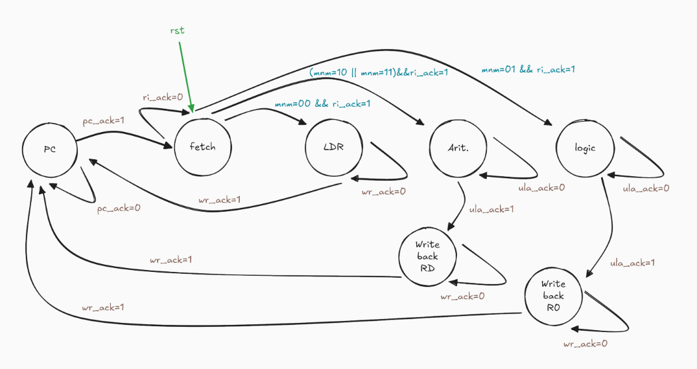
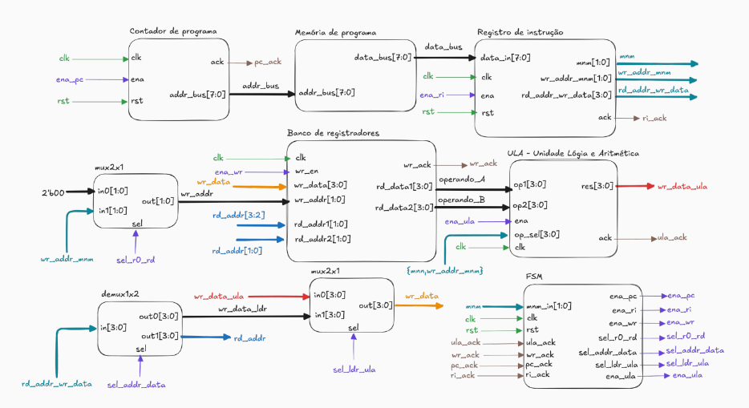

# 💾 4-bit MicroCore for DE10-Lite


This repository contains the implementation of a simple 4-bit microcontroller core, designed for DE10-Lite FPGA. The microcontroller is build using Verilog HDL and is intended for edcucational purposes, demonstrating basic microcontroller architecture and functionality. It's also the final project for the Digital Electronics 2 course (ELTD12A) at UNIFEI - Universidade Federal de Itajubá.

---

## 📚 Project Overview

- Built with **Verilog HDL**.
- Designed for **DE10-Lite FPGA**.
- Simple **4-bit** architecture.
- **Quartus Prime Lite** software for synthesis and implementation.

---

## 📂 Repository Structre

```plaintext
4bit-microcore/
├── assets/                         # Project assets (images, diagrams, etc.)
├── modules/                        # Verilog modules for the microcontroller
│       └── bcd_disp.v                  # BCD to 7-segment display converter
│       └── demux1x2_4bit.v             # 1-to-2 demultiplexer for 4-bit signals 
│       └── fsm.v                       # Finite State Machine module
│       └── instrucion_register.v       # Instruction Register module
│       └── mux2x1_2bit.v               # 2-to-1 multiplexer for 2-bit signals
│       └── mux2x1_4bit.v               # 2-to-1 multiplexer for 4-bit signals
│       └── program_counter.v           # Program Counter module
│       └── register_file.v             # Register File module
│       └── rom_8x256.v                 # 8x256 Read-Only Memory module
│       └── top_module.v                # Top-level module integrating all components
│       └── ula_4bit_sync.v             # Arithmetic Logic Unit module
├── pinouts/                        # Pinout configurations for DE10-Lite
├── LICENSE                         # License information
└── README.md                       # Project overview and documentation
```

---

## 📦 Modules

| Verilog Module      | Description                                      |
| ------------------- | ------------------------------------------------ |
| bcd_disp            | Converts BCD values to 7-segment display format. |
| demux1x2_4bit       | 1-to-2 demultiplexer for 4-bit signals.          |
| fsm                 | Finite State Machine for control logic.          |
| instrucion_register | Instruction Register module.                     |
| mux2x1_2bit         | 2-to-1 multiplexer for 2-bit signals.            |
| mux2x1_4bit         | 2-to-1 multiplexer for 4-bit signals.            |
| program_counter     | Program Counter module.                          |
| register_file       | Register File module for storing data.           |
| rom_8x256           | 8x256 Read-Only Memory module.                   |
| top_module          | Top-level module integrating all components.     |
| ula_4bit_sync       | 4-bit Arithmetic Logic Unit (ALU) module.        |

---

## 🖥️ How the State Machine Works

The Finite State Machine created follows a workflow with the following states:

<font size="2">**Figure 1:** FSM Diagram.</font>

The ALU unit controls the operations based on the instruction mnemonics as the FSM transitions through the states:

1. **Program Counter** (PC): Increments the program counter to point to the next instruction.
    - After incrementing, it transitions to the `FETCH` state.
2. **FETCH**: The microcontroller fetches the instruction from memory.
    - If the mnmemonic is `00` and the acknowledge signal is high, it transitions to the `LDR` state.
    - If the mnmemonic is `10` or `11` and the acknowledge signal is high, it transitions to the `Arit` state.
    - If the mnmemonic is `01` and the acknowledge signal is high, it transitions to the `Logic` state.
    - Otherwise, it remains in the `FETCH` state.
3. **LDR**: Load instruction execution.
    - After execution, it transitions back to the `PC` state, which is the program counter.
    - If the acknowledge signal is low, it remains in the `LDR` state.
4. **Arit**: Arithmetic instruction execution.
    - If the mnemonic is `10`, it performs addition.
    - If the mnemonic is `11`, it performs subtraction.
    - After execution, it transitions to the `Write back RD` state.
    - If the acknowledge signal is low, it remains in the `Arit` state.
5. **Logic**: Logic instruction execution.
    - If the two following bits are `00`, it performs OR operation.
    - If the two following bits are `01`, it performs AND operation.
    - If the two following bits are `10`, it performs XOR operation.
    - If the two following bits are `11`, it performs NAND operation.
    - Otherwise, it remains in the `Logic` state.
    - After execution, it transitions to the `Write back R0` state.
6. **Write back RD**: Writes the result of arithmetic operations back to the destination register.
    - After writing back, it transitions to the `PC` state.
    - If the acknowledge signal is low, it remains in the `Write back RD` state.
7. **Write back R0**: Writes the result of logic operations back to register R0.
    - After writing back, it transitions to the `PC` state.
    - If the acknowledge signal is low, it remains in the `Write back R0` state.

---

## 🧱 Modules Integration

- The top-level module (`top_module.v`) integrates all the individual modules to form the complete 4-bit microcontroller core. It connects the program counter, instruction register, register file, ALU, and other components to ensure proper data flow and control signal management.
- It also handles the display output through the BCD to 7-segment display converter, allowing users to visualize the microcontroller's operations, and control `clock` and `reset` signals.
- The following image illustrates the proposed integration of the modules:
<p align="center">
  
</p>

<font size="2">**Figure 2:** Modules Integration Diagram.</font>

- For presentation purposes, the project is tested based on a predefined instruction set loaded into the ROM module. The `./assets/rom.txt` file contains the instructions used for testing the microcontroller's functionality. 

---

## 🛠️ Requirements

- **Quartus Prime Lite** (18.1 version recommended).
- **ModelSim Altera** for simulation.
- **DE10-Lite FPGA** board (10M50DAF484C7G).

---

## ⚙️ How to run

1. **Clone the repository**:
   ```bash
   git clone git@github.com:pedrocorsini/4bit-microcre.git
   ```
2. **Open Quartus Prime Lite** and create a new project.
3. **Select 10M50DAF484C7G** (MAX 10 Family - DE10-Lite) as the target device.
4. **Add the Verilog files** from the `modules/` directory to your project.
5. **Select ModelSim Altera** as the simulator for simulation purposes.
6. **Import the pinout** configuration from the `pinouts/` directory.
7. **Compile the project and upload** it to the **DE10-Lite FPGA**.

---

## 📄 License

This project is licensed under the MIT License. See the [LICENSE](LICENSE) file for details. It has been created for educational purposes and can be freely used and modified.

---

## 🙏 Acknowledgements

- UNIFEI - Universidade Federal de Itajubá
- ELTD12A course - Eletrônica Digital 2 - 2025.2

---

## 📬 Contact

- Pedro Corsini - 2024004107
- email: pedrocorsini013@gmai.com

---

If you find this project useful or interesting, please consider giving it a star ⭐ on GitHub!